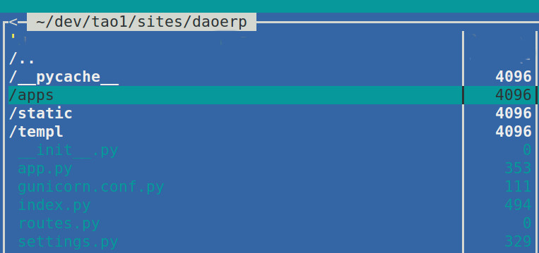
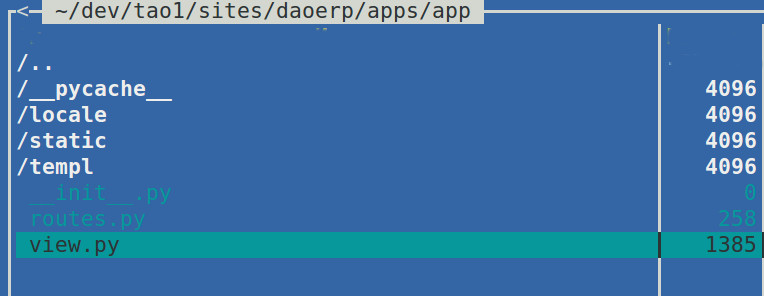

Introduction
============
This asynchronous framework with a modular structure like Django. But with mongodb, jinja2, websocket out of the box, and more than a simple barrier to entry.

Framework Installation
----------------------

::

   $ pip install tao1

Getting Started
---------------

Create a project anywhere::

   $ utils.py -p name

Create an application in the folder of the project apps::

   $ utils.py -a name
Run server::

   $ python3 index.py

Source code
-----------

The project is hosted on `GitHub <https://github.com/alikzao/tao1>`_

Please feel free to file an issue on the `bug tracker
<https://github.com/alikzao/tao1/issues>`_ if you have found a bug
or have some suggestion in order to improve the library.

Dependencies
------------
Python 3.5+ and `aiohttp <https://github.com/KeepSafe/aiohttp>`_

Installation Python 3.5 for ubuntu::

   sudo add-apt-repository ppa:fkrull/deadsnakes
   sudo apt-get update
   sudo apt-get install python3.5 python3.5-dev

Deploy
======
When you develop enough to run the file ``python3 index.py``.
For production to run ``index.py``, is better to use the ``supervisor`` and ``nginx``.
Settings supervisor in ``/etc``::

   [program:name]
   command=python3 index.py
   directory=/path/to/your/project
   user=nobody
   autorestart=true
   redirect_stderr=true

Settings nginx in ``/etc``::

   server {
        server_name        aio.dev;
         location / {
                 proxy_pass http://127.0.0.1:8080;
         }
        location /ws {
              proxy_pass http://127.0.0.1:8080;
              proxy_http_version 1.1;
              proxy_set_header Upgrade $http_upgrade;
              proxy_set_header Connection "upgrade";
       }
   }
Structure
=========
Project structure:

- In the ``locale`` folder there are the translation files.
- In the ``static`` folder are static files, scripts .js, styles .css, images, etc.
- In the ``templ`` folder there are the templates.

- In folder ``apps`` contains ``app``.
- ``index.py`` this is run servers files.
- ``settings.py`` this is settings files.
- ``gunicorn.conf.py`` this is configuration files for gunicorn. Not mandatory.
- ``app.py`` like ``index.py`` but for gunicorn. Not mandatory.

Module structure:

Routes
======
Example route in file ``routes.py``::

   route( 'GET', '/ws',  ws,  'ws' )
Templates
=========
In framework integrated ``jinja2``. Templates are always in the ``templ`` folder.

To call the template function ``templ`` and pass it the template name. If the template is in some sort of module,
the call looks like this ``apps.modul_name.templ_name``.

If the template is in the root of the project in the templ folder, then simply write his name.

Example::

   def page(request):
       return templ('index', request, {'key':'val'} )

Websockets
==========
The websocket to create games and chat very easy to use.

The first is the need to call route with the template to draw the route and chat with the handler for chat:

.. code-block:: python

   route( 'GET', '/ws',   ws,          'ws' )
   route( 'GET', '/wsh',  ws_handler,  'ws_handler' )

These routes work you can see an example.

The second is the functions themselves.
Function for render chat page

.. code-block:: python

   async def ws(request):
       return templ('apps.app:chat', request, {} )

Function handler chat:

.. code-block:: python

   async def ws_handler(request):
      ws = web.WebSocketResponse()
      await ws.prepare(request)
      async for msg in ws:
          if msg.tp == aiohttp.MsgType.text:
              if msg.data == 'close':
                  await ws.close()
              else:
                  ws.send_str(msg.data + '/answer')
          elif msg.tp == aiohttp.MsgType.error:
              print('ws connection closed with exception %s' % ws.exception())
      print('websocket connection closed')
      return ws

Database
========
To write the database query you need to ``request.db``
and then as usual.

.. code-block:: python

    async def test_db(request):
	    # save doc
	    request.db.doc.save({"_id":"test", "status":"success"})
	    # find doc
	    val = request.db.doc.find_one({"_id":"test"})
	    return templ('apps.app:db_test', request, {'key':val})

Static files
============
 Static files it is better to entrust ``nginx`` but ``tao1`` able return files.

 All files must be located in the folder static.

 If they are the root of the project then the path will be like this ``/static/static/file_name.pg``.
 If the files are in a certain module, then the path like this ``/static/module_name/file_name.jpg``.

Caching
=======
Create cache for function 5 second, the first parameter - name::

   @cache("main_page", expire=5)
   async def page(request):
       return templ('index', request, {'key':'val'} )

Game
====
Game start is located on the route ``/pregame``.
The game is a 3D multiplayer shooting.

Low-level
=========
pass

