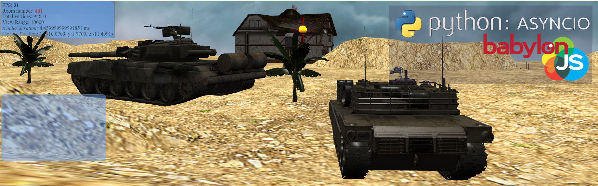
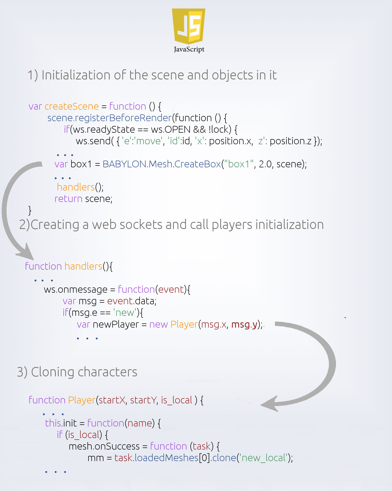
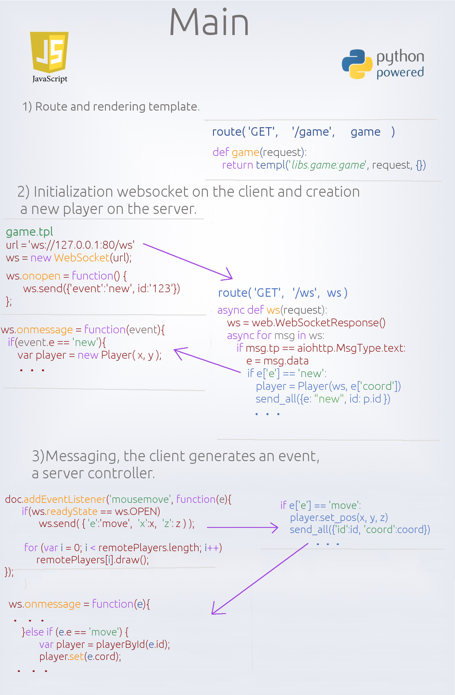
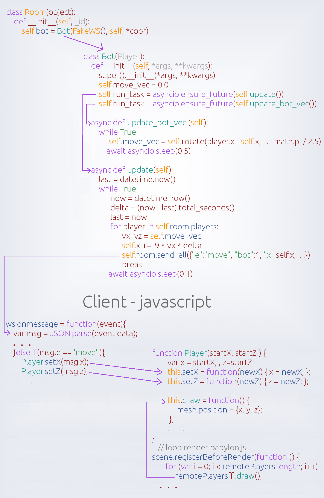

Game framework
==============

About game framework
--------------------
In this case, the game framework is a battery, the basic framework. The game is a 3D multiplayer shooting.
Prototype game framework have  multiplayer mode, the mini-map, rooms, bot, several typical models of tanks.
The client side is written in the framework ``WEBGL`` babylon.js.

Game consists of `babylon.js <https://github.com/alikzao/tao1/issues>`_ and python 3.5.

Getting Started
---------------
Game start is located on the route ``/pregame``.

Low-level game framework
========================

Import models and blender
-------------------------
For games need 3D models to represent characters and landscape. For this you can use a free 3D editor `blender <https://www.blender.org/>`_.
Model you can draw or import with free resources, for example `here <http://tf3dm.com/>`_ or `here <http://www.blendswap.com/blends>`_.

If the model will move around the map, they need to do monolithic. There are two ways.
First method. To make all elements in the model as one object. If there is only one texture.
You need to select all model elements, they are highlighted in orange. And in the ``object`` menu select ``join``.

.. image:: https://habrastorage.org/files/f64/0b6/366/f640b63667a146019cd9dc76b21fac64.jpg

Second method. To associate all the elements of the model according to the principle of parent-child.
This option can be used if we have a lot of textures in the model.
To do this, right-click to select alternately the parent and the child, press ``ctrl+P`` to select the menu ``object``.

.. image:: https://habrastorage.org/files/b7b/b83/01d/b7bb8301db2c407f96a020b42d9bc408.jpg

Loading models in the game with babylon.js and the models themselves
--------------------------------------------------------------------

Of movement, the minimap and the sound of babylon.js
----------------------------------------------------

The websocket and sync game
---------------------------

Backend
-------

Balancing players by rooms
--------------------------

.. image:: _static/game_en_2.jpg

Asyncio and generation behavior of the bot
------------------------------------------

Nginx and proxying sockets
--------------------------

Roadmap game
------------

- Is bot
- Is room
- Multiplayer shooter

.. code-block:: python

   #route( 'GET', '/ws',   ws,          'ws' )

